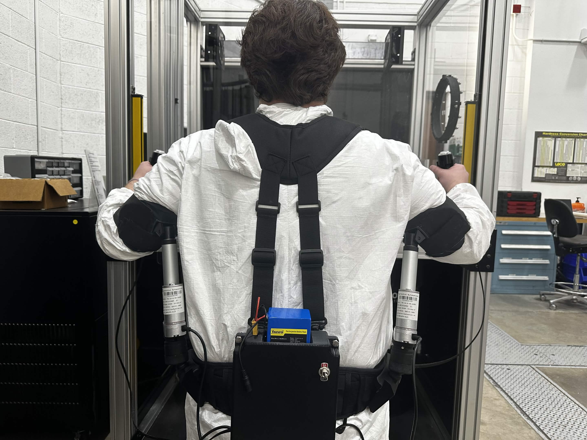

<h1 style="text-align: center; font-size: 4rem; margin-bottom: 0.5rem;">
Robotic Exoskeleton for Glovebox Operators
</h1>

<h2 style="margin-top: 1.5rem;">Senior Design Project (Overview)</h2>

<strong>Arizona State University Polytechnic</strong> 
<strong>Industry Partner Sponsor:</strong> Los Alamos National Laboratory (LANL)

Designed and prototyped a wearable robotic exoskeleton intended to reduce shoulder and arm fatigue experienced by glovebox operators working in hazardous environments.The system redistributed arm loading forces into the hips using actuator-assisted support mechanisms while maintaining operator mobility and ergonomic flexibility.

This project was awarded the <strong>Principled Innovation Award</strong> for engineering innovation and human-centered design.

## Demonstration Video

<iframe 
    src="https://www.youtube.com/embed/ochK-f-7WtE"
    title="Robotic Exoskeleton Demonstration"
    frameborder="0"
    allow="accelerometer; autoplay; clipboard-write; encrypted-media; gyroscope; picture-in-picture; web-share"
    allowfullscreen
    style="position: absolute; top: 0; left: 0; width: 100%; height: 100%;">
</iframe>

---

## Engineering Objectives

The project addressed ergonomic and operational challenges experienced by LANL glovebox operators, including:

- Sustained awkward shoulder and arm positioning
- Muscle fatigue during repetitive operations
- Reduced workplace efficiency
- Long-term musculoskeletal injury risks
- ALARA compliance requirements for hazardous environments

The exoskeleton was engineered to:
- Reduce upper-body fatigue
- Improve operator endurance
- Preserve full working mobility
- Support multiple body sizes and anthropometric ranges
- Remain modular and field-serviceable

---

## Mechanical Engineering Contributions

### CAD Design and Mechanical Systems
- Designed custom exoskeleton components using CAD software
- Developed modular actuator mounting systems
- Engineered rotational joints to preserve natural arm movement
- Designed adjustable arm cuff assemblies for operator comfort
- Integrated universal joints and support structures for multi-axis mobility

### Rapid Prototyping
- Produced multiple prototype iterations using 3D printing
- Utilized PLA and TPU materials depending on flexibility requirements
- Refined mechanical assemblies through iterative testing

### Ergonomic Engineering
- Applied anthropometric analysis using ANSUR II datasets
- Designed sizing systems accommodating:
  - 5th percentile female
  - through 95th percentile male
- Reduced pressure concentration around sensitive arm regions

---

## Electrical and Embedded Systems Engineering

### Embedded Controls
- Programmed actuator control logic using Arduino (C++)
- Implemented bidirectional actuator movement logic
- Designed user input systems using push-button controls

### Power and Electronics
- Integrated:
  - Arduino UNO R3
  - L298N motor drivers
  - 24V lithium-ion battery system
  - voltage regulation circuitry
  - WAGO power distribution connectors

### Electrical Housing Design
- Designed custom protective electronics housing
- Implemented modular mounting system compatible with MOLLE webbing
- Developed wire management and strain-relief solutions

---

## Software Development

### Control Logic
Developed actuator control software in C++ using the Arduino IDE.

Implemented:
- button state tracking
- double-press logic
- actuator extension/retraction control
- timing-based failsafes
- bidirectional motor control

### System Architecture
- Designed UML-based software logic flow
- Balanced usability with operational simplicity
- Prioritized reliability in hazardous work environments

---

## Engineering Analysis and Testing

### Analytical Engineering
Performed calculations and validation for:
- actuator force requirements
- anthropometric sizing
- cuff geometry
- support loading
- actuator extension limits

### Prototype Validation
Conducted testing focused on:
- fatigue reduction
- support load capability
- total device weight
- range of motion
- operator usability

Testing demonstrated successful reduction of muscular fatigue while maintaining lightweight operation and mobility.

---

## Technical Skills Demonstrated

<ul>
<li>Mechanical CAD Design</li>
<li>Embedded Systems</li>
<li>Arduino Programming</li>
<li>C++ Development</li>
<li>3D Printing</li>
<li>Rapid Prototyping</li>
</ul>

<ul>
<li>Systems Integration</li>
<li>Electrical Wiring</li>
<li>Engineering Analysis</li>
<li>Human-Centered Design</li>
<li>Testing & Validation</li>
<li>Technical Documentation</li>
</ul>

---

## Key Outcomes

- Successfully developed a functional robotic exoskeleton prototype
- Reduced operator fatigue during sustained positioning tasks
- Designed modular hardware for maintainability and adjustability
- Delivered a multidisciplinary engineering solution for LANL
- Received the Principled Innovation Award

---

## Additional Documentation

[View Full Final Report](../assets/Team21_Final_Report.pdf)